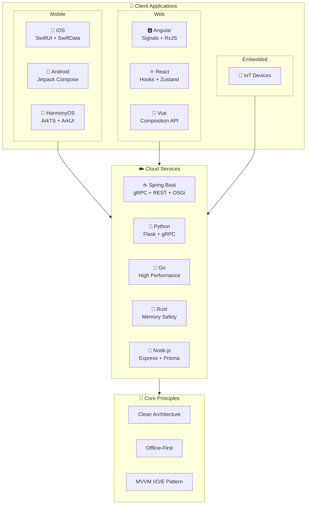

    
**System/Software Architect | Full-Stack Developer | Taiwan**

*Building enterprise-grade applications with Clean Architecture design*

---

## 🏗️ Arcana Architecture Suite

A comprehensive collection of enterprise-grade reference architectures implementing **Clean Architecture**, **Offline-First** design, and **MVVM patterns** across multiple platforms.

---

## 📱 Mobile Development

| Platform | Repository | Tech Stack | Description |
|:--------:|:-----------|:-----------|:------------|
| 🍎 | [**arcana-ios**](https://github.com/jrjohn/arcana-ios) | Swift, SwiftUI, SwiftData | Clean Architecture with Offline-First design and Analytics Tracking |
| 🤖 | [**arcana-android**](https://github.com/jrjohn/arcana-android) | Kotlin, Jetpack Compose, Hilt | Clean Architecture with Offline-First design and AOP Analytics |
| 🔷 | [**arcana-harmonyos**](https://github.com/jrjohn/arcana-harmonyos) | ArkTS, ArkUI | HarmonyOS NEXT application with Clean Architecture |

---

## 🌐 Web Development

| Framework | Repository | Tech Stack | Description |
|:---------:|:-----------|:-----------|:------------|
| 🅰️ | [**arcana-angular**](https://github.com/jrjohn/arcana-angular) | TypeScript, Angular, Signals | Production-ready with Offline-First capabilities and Enterprise Security |
| ⚛️ | [**arcana-react**](https://github.com/jrjohn/arcana-react) | TypeScript, React 19, Zustand | Enterprise-grade with MVVM Input/Output/Effect pattern |
| 💚 | [**arcana-vue**](https://github.com/jrjohn/arcana-vue) | TypeScript, Vue 3, Pinia | Modern Vue application with Composition API |

---

## ☁️ Cloud Services

| Language | Repository | Tech Stack | Description |
|:--------:|:-----------|:-----------|:------------|
| ☕ | [**arcana-cloud-springboot**](https://github.com/jrjohn/arcana-cloud-springboot) | Java, Spring Boot, gRPC | Dual-protocol (gRPC 2.5x faster), OSGi Plugin System, GraalJS SSR |
| 🐍 | [**arcana-cloud-python**](https://github.com/jrjohn/arcana-cloud-python) | Python, Flask, gRPC | gRPC-first architecture (2.78x faster), flexible deployment modes |
| 🐹 | [**arcana-cloud-go**](https://github.com/jrjohn/arcana-cloud-go) | Go, Gin/Fiber, gRPC | High-performance microservices with native concurrency |
| 🦀 | [**arcana-cloud-rust**](https://github.com/jrjohn/arcana-cloud-rust) | Rust, Actix/Axum | High-performance cloud services with memory safety |
| 💚 | [**arcana-cloud-nodejs**](https://github.com/jrjohn/arcana-cloud-nodejs) | Node.js, Express, Prisma | InversifyJS DI, gRPC-first (1.80x faster), dual-protocol support |

---

## 🔧 Embedded Systems

| Platform | Repository | Description |
|:--------:|:-----------|:------------|
| 🔌 | *Coming Soon* | IoT and embedded system implementations |

---

## 📊 GitHub Activity

---

*"Architecture is not about frameworks and tools, it's about making the right decisions at the right time."*

**@ Nirvana | Taiwan**

